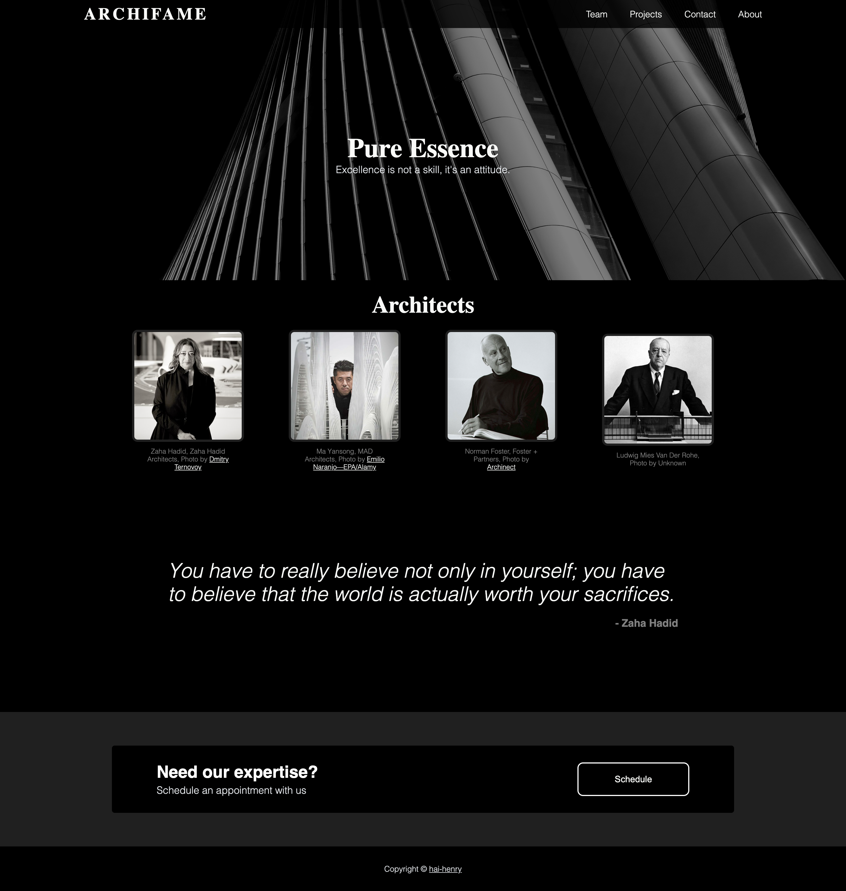

# odin-landing-page

Odin Project: Landing Page

Using HTML and CSS to create a landing page for the Odin Project.

For practice and educational purposes only. I do not own the rights to the images used in this project. The photo behind the title "Pure Essence" is by <a href="https://unsplash.com/@rgaleriacom?utm_source=unsplash&utm_medium=referral&utm_content=creditCopyText">Ricardo Gomez Angel</a> on <a href="https://unsplash.com/photos/otf25n2UETg?utm_source=unsplash&utm_medium=referral&utm_content=creditCopyText">Unsplash</a>

Live preview: https://hai-henry.github.io/odin-landing-page/

## Desired Outcome

## Personal Outcome

Taking inspiration from the original layout, I decided to make a landing page for a few of my favorite Architects.

